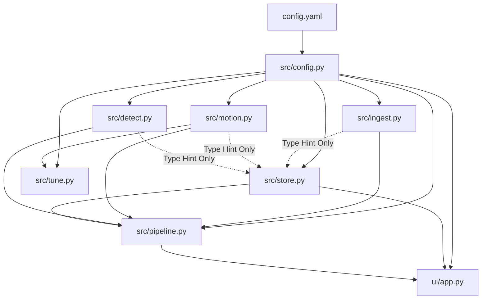

# Dependency Map — CCTV Motion Analyzer

## 모듈별 요약
- [src/config.py](file:///Users/chanhojung/Downloads/CCTV_Analysis/src/config.py): `config.yaml` 스키마 검증 및 dataclass 바인딩. 모든 모듈이 공유.
- [src/ingest.py](file:///Users/chanhojung/Downloads/CCTV_Analysis/src/ingest.py): 비디오 메타데이터 ffprobe 추출 및 H.264 MP4로의 정규화(FFmpeg).
- [src/motion.py](file:///Users/chanhojung/Downloads/CCTV_Analysis/src/motion.py): `dvr-scan` CLI 래퍼. `--scan-only` 옵션으로 모션 시작/종료 세그먼트 추출.
- [src/detect.py](file:///Users/chanhojung/Downloads/CCTV_Analysis/src/detect.py): YOLO 객체 감지 및 OpenCV MOG2 배경 차분 마스크 융합(정지 객체 오탐 제거).
- [src/store.py](file:///Users/chanhojung/Downloads/CCTV_Analysis/src/store.py): SQLite 데이터 저장 및 관계 매핑 (`videos` - `motion_events` - `detections`).
- [src/pipeline.py](file:///Users/chanhojung/Downloads/CCTV_Analysis/src/pipeline.py): 개별 모듈 오케스트레이션 및 다중 파일 일괄 처리 지원.
- [ui/app.py](file:///Users/chanhojung/Downloads/CCTV_Analysis/ui/app.py): Streamlit 기반 결과 검토 및 임계값 튜닝용 대시보드.
- [src/tune.py](file:///Users/chanhojung/Downloads/CCTV_Analysis/src/tune.py): 영상별 DVR-Scan 모션 임계값 튜닝을 위한 커맨드라인 스윕 툴.
